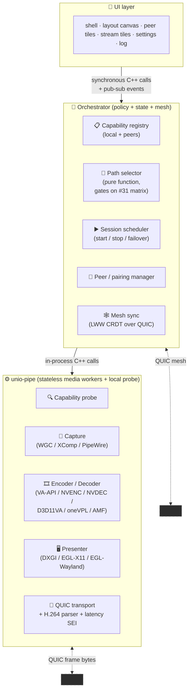
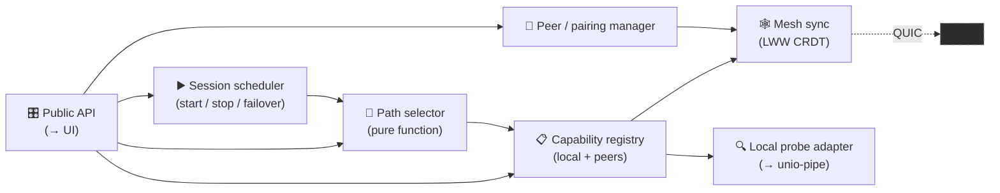
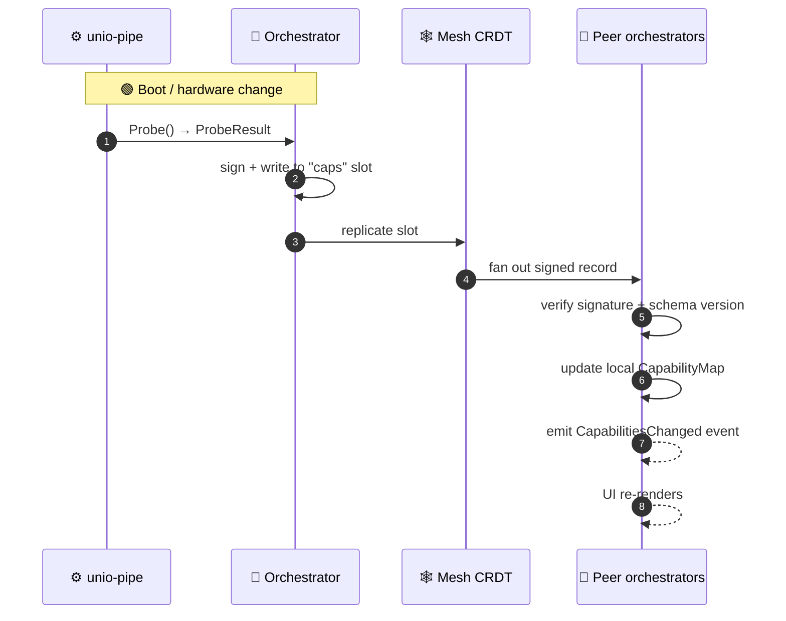
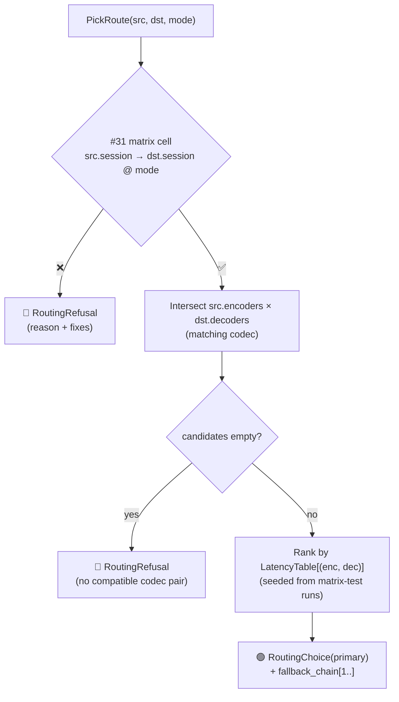
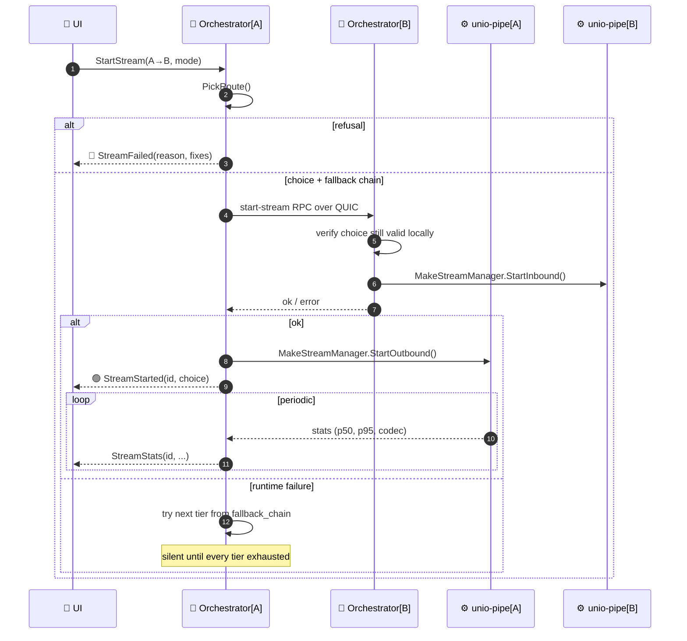

# 🏗️ UnIO — Architecture

> [!NOTE]
> **Status:** first draft, 2026-04-24. This document is the starting
> point for the architecture discussion; it is not yet locked.
> Sections flagged **`🟡 OPEN`** have pending decisions the team owns.
> Once every `🟡 OPEN` is resolved, this file becomes the canonical
> architectural reference and feeds directly into the requirements
> document.

---

## 1. 🎯 Product shape

UnIO is a **single signed binary per OS** (Windows, Linux). One install
artefact, one running process, one log, one stack trace. Written
entirely in **C++20 — every layer, including the UI**. The binary
bundles everything a user needs to run UnIO:

- ❌ No Python runtime.
- ❌ No browser engine (no Electron, no CEF, no WebView2, no Tauri).
- ❌ No JavaScript / TypeScript bundle.
- ❌ No Dart / Flutter.
- ❌ No scripting runtime of any kind.
- ❌ No separate helpers on disk, no sidecar processes.
- ✅ Native C++ all the way from the OS display / input APIs up to the pixel the user clicks on.

### Product commitments that drive the architecture

| # | Commitment | Architectural consequence |
|---|---|---|
| 1 | 🖥️ **Distributed multi-monitor desktop** — cursor walks every screen, keyboard follows cursor, any monitor can display any other machine's desktop. | Mesh of peers, shared CRDT state, distributed display-routing. |
| 2 | 🏠 **LAN-only — desk hardware management** — UnIO unifies PCs that share a desk or a room, not PCs across the internet. | No WAN, no relay, no NAT punching, no rendezvous server, no STUN/TURN. Discovery + all peer traffic assume direct LAN reachability. |
| 3 | ⚡ **Install, sign in, it works** — zero manual driver installs, zero sudo prompts outside the installer, no config-file editing. | All OS-level privilege done once at install time. Runtime is user-privilege-only. |
| 4 | 🌐 **Same UX everywhere** — Windows + Linux parity (macOS deferred). | Shared orchestrator module; per-OS code is isolated to a thin backend layer. |
| 5 | 🖼️ **Physical monitors only** — no virtual displays, no IDD, no evdi. | Display routing operates on real connectors; no kernel drivers shipped. |
| 6 | 🎬 **Hardware H.264 encoding required** — no software fallback. | Hosts without HW encoder refuse display streaming cleanly; other features still work. |

### Companion docs

- [`unio-pipe/ARCHITECTURE.md`](unio-pipe/ARCHITECTURE.md) — media pipeline details (capture / encode / transport / decode / present). Phase 3 of the port absorbs that tree into root `src/`; its content migrates into this doc as a subsection.
- [Issue #31](https://github.com/4d1-1010/Stitch/issues/31) — live coverage matrix (GPU tiers + routing modes).
- [Issue #34](https://github.com/4d1-1010/Stitch/issues/34) — C++ port umbrella + phase schedule.

---

## 2. 🧱 Three-layer model

One binary, three internal layers. They talk to each other via C++
function calls — there is **no IPC boundary** between them.



### Responsibilities

| Layer | ✅ Owns | ❌ Must NOT know about |
|---|---|---|
| **`unio-pipe`** | Capture / encode / decode / present / QUIC frame bytes / local capability probe. | Peers · mesh · policy · user intent · pairing. |
| **Orchestrator** | Mesh CRDT · capability map · path selection · session lifecycle · fallback chains · pairing / trust. | GUI framework · window layout pixels. |
| **UI** | User intent · rendering · layout canvas · UI-local input. | Codec names · transport details · CRDT merge rules · matrix cells. |

### Why a three-layer split

- 🔒 **`unio-pipe` stays replaceable.** Narrow public interface means a future port to a different media stack touches one layer.
- 🧠 **Orchestrator is the policy seat.** Everything that's "think before you act" lives here.
- 🎨 **UI is decoration.** Swap GUI frameworks without touching the other layers.

---

## 3. ⚙️ `unio-pipe` layer (bottom)

Narrow, stateless-per-call, fast. Already exists as **~13.5 KLoC** in
`unio-pipe/src/` + `unio-pipe/include/`; Phase 0 moves that tree to
root `src/` + `include/` unchanged. Phase 3 drops the `ControlSocket`
+ separate-binary story.

<details>
<summary>📎 Public entry points (what the orchestrator calls)</summary>

```cpp
namespace unio::pipe {

  // One-shot capability probe. Cached once per process; rerun only
  // on explicit hardware-change signal.
  ProbeResult Probe();

  // StreamManager per active routing line. Owns the pipeline for
  // one direction of one stream (capture → encode → QUIC → peer,
  // or peer → QUIC → decode → present).
  class StreamManager {
   public:
    std::optional<std::string> StartOutbound(OutboundConfig);
    std::optional<std::string> StartInbound(InboundConfig);
    void Stop();
    void RequestIdr();
  };
  std::unique_ptr<StreamManager> MakeStreamManager();

}  // namespace unio::pipe
```

</details>

Stateless beyond the lifetime of an individual `StreamManager`. No
mesh state, no peer list, no pairing awareness — the orchestrator
hands `StreamManager` a pre-authenticated QUIC endpoint to talk to.

---

## 4. 🧠 Orchestrator layer (middle)

New module; doesn't exist as C++ yet. Takes over everything
`helper_bridge.py` + `unio/layout.py` + `unio/mesh.py` do today in
the Python tree, **plus** the new capability-map + path-selector work
from [#63](https://github.com/4d1-1010/Stitch/issues/63).

### Internal sub-modules



<details>
<summary>📎 Public API surface (what the UI calls)</summary>

```cpp
namespace unio::orchestrator {

// --- Probe / map queries ---
ProbeResult                         LocalCapabilities();
std::unordered_map<PcId, PeerRecord> CapabilityMap();

// --- Path planning (pure) ---
std::variant<RoutingChoice, RoutingRefusal>
PickRoute(PcId src, PcId dst, RoutingMode mode);

// --- Session control ---
StreamId    StartStream(PcId src, PcId dst,
                        DisplayRef src_disp, DisplayRef dst_disp,
                        RoutingMode mode);
void        StopStream(StreamId);
StreamState GetStreamState(StreamId);

// --- Events (pub-sub) ---
void Subscribe(EventKind, std::function<void(Event)>);

}  // namespace unio::orchestrator
```

Events the orchestrator emits:

- 👋 `PeerJoined`, `PeerLeft`, `PeerCapabilitiesChanged`
- 🟢 `StreamStarted`, 🔴 `StreamFailed`, 🟡 `StreamRecovered`, ⏹️ `StreamStopped`
- 🔐 `PairingRequest`, `PairingAccepted`, `PairingRejected`
- 🖱️ `InputEvent` (later — Phase 2)
- 📋 `ClipboardUpdate` (later — Phase 2)

</details>

---

## 5. 🎨 UI layer (top)

Consumes the orchestrator's public API. Every user interaction is
one of:

- 🔎 A **query** — "show me the capability map so I can draw the layout" → `CapabilityMap()` + `PickRoute()` per line-drop preview.
- ▶️ A **command** — "start this stream" → `StartStream(...)`.
- 📡 A **subscription** — "tell me when state changes" → `Subscribe(...)`.

No direct talk to `unio-pipe`, ever. No mesh / CRDT awareness beyond
what the orchestrator exposes through its API.

### Screens (rough, Phase 5 / [#40] refines)

- 🎨 **Layout canvas** — PCs as containers, displays as rectangles inside each PC, routing lines between displays.
- 👥 **Peer list / discovery** — who's online, who's paired, pairing prompts.
- 📺 **Stream tiles** — live status of each active stream (latency, throughput, codec in use, fallback tier if degraded).
- ⚙️ **Settings** — shortcuts, pairing codes, log verbosity.
- 📋 **Log / diagnostics** — latency histograms, last N errors, copy-to-clipboard for support.

> [!IMPORTANT]
> **🔒 LOCKED: UI is native C++.** No web framework, no embedded
> runtime, no scripting layer. Compiles into the same binary as
> the orchestrator and `unio-pipe`.
>
> **🟡 OPEN: which C++ UI toolkit** (Phase 0 / [#35]).
>
> Hard requirements (a toolkit without all four is rejected):
> - ✅ Native C++ API; compiles into the binary (no separate runtime shipped to the user).
> - ✅ Works on Windows + Linux with consistent layout primitives.
> - ✅ Supports custom-drawn canvas widgets (the Layout canvas is non-trivial — draggable display rectangles, live routing-line previews, multi-select, zoom).
> - ✅ Permissive / commercial-safe licence (MIT / BSD / Apache / LGPL-with-dynamic-link / wxWindows). See `feedback_commercial_license.md`.
>
> Candidates under consideration:
>
> | Toolkit | Licence | Notes |
> |---|---|---|
> | **Qt 6** | LGPL-3 / commercial | Mature, most complete widget set. LGPL dynamic-link ok for commercial shipping but installer plumbing non-trivial. Widely used for cross-platform native apps. |
> | **Dear ImGui** | MIT | Immediate-mode, fast iteration. Less common for full shipping apps; more DIY for native-feel widgets. Excellent fit for the Layout canvas's custom drawing. |
> | **wxWidgets** | wxWindows (~LGPL + link exception) | Native host widgets, no custom-draw look-and-feel gymnastics. Older codebase but battle-tested. |
> | **Slint** | MIT / commercial | Rust core with a C++ API that compiles into the binary. Declarative UI language. Newer but built for native cross-platform. |
> | **Custom GL / Skia toolkit** | your own | Highest control (matches OS look-and-feel exactly), highest cost — weeks per screen. |
>
> Decision criterion: whichever toolkit gets the Layout canvas prototype working fastest in Phase 0 with all four hard requirements met wins.

---

## 6. 🕸️ Mesh / CRDT

Each pairing-trusted peer is a slot in the shared state. Slots are
**LWW (last-write-wins per key, signed by the owner's pairing key)**.

### Record types per peer slot

| Slot | Schema | Writer | Readers |
|---|---|---|---|
| `caps` | `ProbeResult` (with `SessionType`, `MonitorInfo[]`, `RoutingModes`) | 📝 own PC only | 👁️ everyone |
| `layout` | Layout graph (PCs, displays, routing lines) | 📝 one PC at a time per edit | 👁️ everyone |
| `workspaces` | Named workspace routing presets | 📝 one PC at a time per edit | 👁️ everyone |
| `pairing` | Pairing records + rotating keys | 📝 bilateral | 👁️ both paired peers |
| `clipboard` | Shared clipboard content + versioning | 📝 whichever PC wrote last | 👁️ everyone |
| `presence` | heartbeat timestamp | 📝 own PC only | 👁️ everyone |

### Transport

QUIC between peer orchestrators (same msquic stack `unio-pipe` already
uses). TLS 1.3 comes with QUIC; auth comes from pairing-derived keypairs.

**Discovery — 🔒 LOCKED (2026-04-24):** given the LAN-only product
commitment, peer discovery uses **mDNS** as the primary mechanism
(zero-config on any LAN, including home Wi-Fi), with **manual
invite / QR-code pairing** as the fallback for LANs where mDNS is
blocked (some corporate / segmented networks). **No rendezvous
server**, no external dependency for peers to find each other.

**Multi-homed PCs — bind everywhere LAN, nowhere public.** The
common desk-setup case has PCs with several active network
interfaces simultaneously (e.g. wired Ethernet + Wi-Fi on the same
router; or a wired NIC + a USB Wi-Fi dongle + a docking-station
Ethernet). Peers on one interface must be reachable from peers on
another interface, so UnIO advertises + listens on **every local
network interface whose primary address is in a private range**:

| Include | Exclude |
|---|---|
| IPv4 RFC 1918 — `10.0.0.0/8`, `172.16.0.0/12`, `192.168.0.0/16` | Public routable IPv4 |
| IPv4 link-local — `169.254.0.0/16` | Loopback (`127.0.0.0/8`, `::1`) |
| IPv6 link-local — `fe80::/10` | Public routable IPv6 |
| IPv6 unique-local — `fc00::/7` | Docker / VM bridges whose far side reaches the internet (inferred via default-route check) |
| VPN / tunnel interfaces whose addressing is private AND whose gateway doesn't have a default route to the internet | VPN interfaces whose default route goes to the public internet (treat as WAN — out of scope) |

Multi-homed same-PC advertisements deduplicate by the PC's pairing
pubkey (not by interface) — the orchestrator collapses "PC X via
Ethernet" + "PC X via Wi-Fi" into a single peer entry and picks
the first-responding path; stores the others as fallback routes
in case one interface drops.

> [!IMPORTANT]
> **🟡 OPEN: mesh connection model** (§8 details).
>
> Two options under consideration:
>
> 1. **Single QUIC connection per peer-pair**, multiplexing media
>    + CRDT sync + RPC + heartbeats on different streams within it.
>    One TLS handshake, simpler state, but one death = all dies.
> 2. **Hybrid: one always-on control connection (CRDT / RPC / heartbeat)
>    per paired peer, plus per-session media connections that open
>    on StartStream and tear down on stop.** Cleaner fault isolation
>    (a media failure doesn't affect discovery / clipboard / layout
>    edits), independent congestion windows, explicit lifecycle.
>
> LAN-only makes (1) much more workable than it'd be on WAN (fewer
> congestion concerns, less need to isolate), but (2)'s clean
> lifecycle + fault isolation benefits don't depend on WAN/LAN.
> Decision is a judgement call on "one-connection simplicity" vs
> "two-connection separation of concerns."

> [!WARNING]
> **🟡 OPEN: schema evolution + cadence.**
>
> - **Capability schema versioning.** Older peers' records may lack
>   new fields. Selector must treat missing fields as conservative
>   defaults. Need explicit schema-version byte + migration rules.
> - **Slot size ceiling.** Cap each `caps` record at ~4 KB JSON-equivalent?
> - **Broadcast cadence.** Event-driven on change + ~60 s heartbeat as insurance? Stale threshold ~120 s?

---

## 7. 🔄 Capability-map lifecycle



### Probe refresh triggers

| Event | Triggered by |
|---|---|
| 🟢 Process start | Initial boot |
| 🖥️ Monitor hot-plug | DRM / RandR event (Linux); `WM_DISPLAYCHANGE` (Windows) |
| 🎮 GPU driver event | udev hotplug (Linux); `WM_WTSSESSION_CHANGE` (Windows) |
| 🔄 User-requested rescan | Settings screen "rescan" button |
| ⏱️ Periodic insurance | Every ~5 minutes |

---

## 8. 🎯 Path selection + fallback

Selector is **pure** — same inputs give same output on every PC. This is
what makes the synchronised map "synchronised" without synchronising the
derived decisions.



> [!TIP]
> **🟡 OPEN: latency-table seeding.**
> 
> The ranking table needs real numbers. Options:
> - 📊 Matrix-test runner ([#51] / [#65]) periodically re-runs + publishes a ranking file that ships with the binary.
> - 🎯 Per-install calibration pass on first boot.
> - 🎲 Hardcoded defaults seeded from measured adi-pc + Diana results.

---

## 9. ▶️ Session lifecycle



### Failover

Silent from the UI's perspective until every tier fails. The
orchestrator handles "NVENC session open failed, try oneVPL next" without
bothering the user.

> [!WARNING]
> **🟡 OPEN: session-state policies.**
>
> - **Reconnection policy.** QUIC drop for 500 ms → (a) hold + transparent reconnect, (b) tear down + restart, (c) give up after N seconds? Proposal: (a) with 5-second max before falling to (b) with next-tier fallback.
> - **Multi-viewer.** Two different PCs streaming in from A to B's same `src_disp` — share the outbound encode session? Requires `unio-pipe::StreamManager` fan-out output list.

---

## 10. 🧵 Threading model

| Concern | Thread |
|---|---|
| 🎨 Main event loop (UI events, orchestrator API calls) | UI / main thread |
| 🕸️ Mesh CRDT sync (network I/O, CRDT merging) | Dedicated mesh thread |
| 🔍 Capability probe | Main thread at boot; refresh on worker |
| 🎥 `unio-pipe` capture | Per-stream capture thread |
| 🎞️ `unio-pipe` encode | Per-stream encode thread |
| 🎞️ `unio-pipe` decode | Per-stream decode thread |
| 🖥️ `unio-pipe` presenter | Per-stream present thread |
| 📡 QUIC | msquic's own thread pool |

Orchestrator state is accessed from multiple threads; one shared
reader-writer lock around the capability map + session registry. Mutex
contention shouldn't be a hot path because everything changes at human
timescales (Hz, not kHz).

---

## 11. 🔐 Security / trust

### Threat model (LAN-only scope)

UnIO's LAN-only commitment narrows the threat model meaningfully:

- ❌ **NOT defending against**: mass internet scanning, WAN attackers, compromised relay servers, off-LAN network adversaries, DPI-based blocking, state-level adversaries.
- ✅ **Defending against**: other users / processes on the same LAN (untrusted roommates, guest Wi-Fi attackers, co-worker PCs in a shared office), stale pairings, same-user processes on the same host trying to snoop UnIO's state, lost / leaked pairing keys.

LAN ≠ trusted. Pairing is still pubkey-based + mutual.

### Controls

- 🤝 **Pairing is mutual + pubkey-based.** Two PCs exchange pubkeys out-of-band (PIN-on-one / enter-on-other, or QR). Every mesh CRDT record is signed with the owning PC's pairing key. Unsigned or invalid-signature records are rejected.
- 🧱 **No IPC inside the binary.** All three layers linked into one process → no pipe / socket an attacker can hit from another same-user process.
- 🔒 **QUIC TLS 1.3** for peer-to-peer. Cert material derived from pairing keys (no external CA).
- 🧰 **Installer privileges.** One-time elevation for OS-level capture + input-redirection permissions (WGC consent on Windows; `xdg-desktop-portal` grant on Linux). Never required at runtime.
- 🏠 **LAN scope enforcement.** See §6 for the full interface-selection table. Short version: UnIO binds to **every** local interface whose primary address is in a private / link-local / unique-local range — wired + wifi + USB NICs + docking Ethernet all at once — so multi-homed PCs remain reachable from peers on any of those interfaces. Interfaces whose default route reaches the public internet are skipped; paired connections are only established to addresses discovered via mDNS or entered manually; never to public IPs.

> [!CAUTION]
> **🟡 OPEN: capability records are sensitive.**
>
> A capability record advertises GPU model, driver version, monitor topology. Trusted peers = fine. But if pairing is broken / key leaks, an attacker learns fingerprintable info. Record schema should only include what the path selector needs, not a full hardware dump. Extensions go through a privacy review.

---

## 12. 🏗️ Build + deployment

| Item | Details |
|---|---|
| 🧰 Build system | **CMake**, single tree. Phase 0 restructures `unio-pipe/src/` → `src/`, `unio-pipe/include/` → `include/`, plus new `src/orchestrator/` + `src/ui/`. |
| 🎯 Target | One binary per OS: `unio` (Windows `.exe`) / `unio` (Linux ELF, statically linked per [#55]). |
| 📦 Installer | Phase 6 ([#41]) wires signing + packaging. Signed MSI (Windows); `.deb` + `.rpm` + AppImage (Linux). |
| 🐳 Reproducible builds | `packaging/docker/build-*.sh` — both binaries from one Docker-equipped orchestrator host. |

---

## 13. 🟡 Open decisions (next discussion pass)

| # | Status | Decision | Context |
|---|---|---|---|
| 1 | 🟡 OPEN | **C++ UI toolkit choice** (category locked: native C++ only) | §5, Phase 0 / [#35] |
| 2 | 🟡 OPEN | **Mesh connection model**: single-QUIC-multiplexed vs hybrid (always-on control + per-session media) | §6 |
| 3 | 🔒 LOCKED | **Peer discovery: mDNS primary + manual invite / QR fallback, no rendezvous server** (enabled by LAN-only scope) | §6 |
| 4 | 🟡 OPEN | **Broadcast cadence + stale thresholds** | §6, §7 |
| 5 | 🟡 OPEN | **Latency-table seeding** for path selector | §8 |
| 6 | 🟡 OPEN | **Multi-viewer fan-out** for single `src_disp` | §9 |
| 7 | 🟡 OPEN | **Reconnection policy** for interrupted QUIC | §9 |
| 8 | 🟡 OPEN | **Capability-record schema version + migration** | §6 |
| 9 | 🟡 OPEN | **`unio-pipe` standalone target post-Phase-3** for `tools/matrix_test.py` + integration tests? | §12 |
| 10 | 🟡 OPEN | **`capture_xcomposite.cpp` hybrid-mode adoption timing** (from `spike/x11-capture-exclude`) — follow-up PR before Phase 3, or during Phase 3? | Separate spike |

Locked this session: **UI category = native C++** (§5), **LAN-only scope** (§1), **peer discovery = mDNS + invite fallback** (§6).

---

## 📎 Cross-references

| Resource | Link |
|---|---|
| Scope memo | `project_unio_display_streaming_scope.md` (memory) |
| Coverage matrix | [#31](https://github.com/4d1-1010/Stitch/issues/31) |
| C++ port umbrella | [#34](https://github.com/4d1-1010/Stitch/issues/34) |
| Phase issues | [#35](https://github.com/4d1-1010/Stitch/issues/35) – [#41](https://github.com/4d1-1010/Stitch/issues/41) |
| C++ port live matrix | [#42](https://github.com/4d1-1010/Stitch/issues/42) |
| Distributed capability map | [#63](https://github.com/4d1-1010/Stitch/issues/63) |
| Same-PC swap | [#64](https://github.com/4d1-1010/Stitch/issues/64) |
| `matrix_test.py` post-port | [#65](https://github.com/4d1-1010/Stitch/issues/65) |
| X11 fullscreen carveout | [#62](https://github.com/4d1-1010/Stitch/issues/62) |
| X11 exclusion spike | `spike/x11-capture-exclude` branch |
